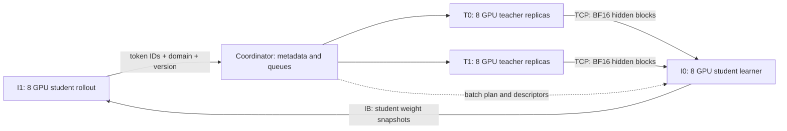

# 32 卡 A100 三资源池 MOPD 与 TileLang 实施规划

状态：原始方案规划。首版代码与本机 A100 验证见 [实现与运行](full-vocab-mopd.md)。本文的配置示意、CPU/NVMe 主干换入换出、异步 snapshot publisher 等仍是规划，不能视为已实现接口。

本文承接 [全词表 MOPD 核心设计](full-vocab-mopd-design.md)，更新部署前提为独立 rollout、teacher 和 learner 三池。旧文中的 learner 内轮换 teacher 主干是可选共置后端，不是本方案的主执行路径。

## 1. 需求与起始决策

- 三个独立规模的纯文本任务：Qwen3.5-2B、Qwen3.5-9B、剪枝 Qwen3.6-19B-A3B。
- 每个任务至少 7 个同构、冻结的领域 RL teacher，每条轨迹只选一个 teacher。
- 19B 的 LM head 按原 Qwen3.6-35B-A3B：V=248320、H=2048；9B 的 H=4096，2B 的 H=2048。
- 4 台机器，每台 8 张 A100；暂按与本机相同的 80GB 显存制定容量预算，其他节点需盘点。
- 暂将两个可使用 IB 的节点记为 I0/I1，假定二者 IB 互通；另外两个只有 TCP 的节点记为 T0/T1，TCP 速率待测。
- 原生最大上下文约 262144，不等于训练应直接使用这一长度。实际数据长度和 global batch 尚未确定。

建议先使用通信风险较低的布局：I0 放 8 卡 learner，I1 放 8 卡 rollout，T0/T1 共 16 卡 teacher。将 16 learner / 8 rollout / 8 teacher 保留为实测后的吞吐比较方案。三种规模分别运行与调优，不在同一 32 卡配置中同时启动三个完整任务。

## 2. 推荐拓扑与另一种分配

### 主方案：8 Learner + 8 Rollout + 16 Teacher



这样把频繁变化、字节数很大的 student 权重留在 IB 链路，把冻结 teacher 的中间目标通过 TCP 传输。teacher checkpoint 和 head 在初始化时分发并本地缓存，正常训练不反复跨节点传整套 teacher 权重。

16 张 teacher 卡并不意味着必须构造一个跨 T0/T1 的 16-rank teacher 模型。采用多个独立、节点内的推理实例；单个 teacher 的 TP/EP/PP group 不跨 TCP 节点。

这不是对最高 tokens/s 的承诺。若 teacher 明显过量、learner 或 rollout 成为瓶颈，再重新分配部分实例；依据是各阶段队列与服务速率，而不是让三池平均分卡。

### 比较方案：16 Learner + 8 Rollout + 8 Teacher

| 节点 | 角色 |
| --- | --- |
| I0 + I1 | 16 GPU learner，跨节点同步走 IB |
| T0 | 8 GPU rollout |
| T1 | 8 GPU teacher |

此布局把跨节点 IB 用于 learner 的 DP/optimizer 通信，但 student 权重更新需要走 TCP。只有当 16 卡 learner 的提速足够大、teacher 在 8 卡上足够快，并且 TCP 权重刷新满足策略陈旧度预算时，才优先选它。

初始避免让 TP/EP/PP 跨节点，把跨节点通信留给需要的 learner 副本同步。MoE expert 分组不一定与普通 DP 分组相同，必须验证实际 rank mapping；不能仅按配置字符串推定 EP 已限制在节点内。

如果 2B 最后主要受 rollout 解码限制，可将多余 teacher GPU 分给额外 rollout 副本；新增 TCP rollout 节点的权重流量仍需重新计入。资源再分配在阶段边界进行，不能在线任意改变已有 Megatron world size。

## 3. 为什么不能忽略 student 权重流量

按标称总参数、BF16 粗估，2B/9B/19B 的 student 权重分别约 4/18/38 GB。A3B 的激活规模不能作为权重同步大小。

为便于比较，以下假设有效 TCP payload 带宽为线速的 80%，即 10/25/100GbE 分别达到 1/2.5/10 GB/s。这是容量模型，不是实测或保证。

| 一次传输 | 10GbE 假设 | 25GbE 假设 | 100GbE 假设 |
| --- | --- | --- | --- |
| 2B student，4 GB | 4.0 s | 1.6 s | 0.4 s |
| 9B student，18 GB | 18.0 s | 7.2 s | 1.8 s |
| 19B student，38 GB | 38.0 s | 15.2 s | 3.8 s |
| 2B/19B hidden，128 条轨迹、平均 4K 监督 token | 2.15 s | 0.86 s | 0.21 s |
| 9B hidden，同上 | 4.29 s | 1.72 s | 0.43 s |

以上不含导出、HF 转换、D2H/H2D、NVMe、排队、校验和 rollout reload。两个 teacher 节点同时发送，还要看 learner 入站总带宽和交换机是否超售，不能直接把两条标称带宽相加。

hidden 每个监督 token 为 `H*2 bytes`，即 4KiB 或 8KiB；128 条、平均 4096 个监督 token，总量为 2GiB 或 4GiB。若平均监督长度翻倍，hidden 流量也翻倍。每条轨迹只有一个 teacher，因此这些值不乘 7。

跨 TCP 每份 hidden 只传到负责该样本的 learner 节点一次，再进行节点内分发。不向每个 TP rank 分别重复发送，也不经中心 RolloutManager 再中转一份。

权重也应按目标 rollout 节点拉取一份后本地扇出。给同节点的多个 rollout engine 分别跨网拉取整个模型，会放大流量。

## 4. 三种模型的资源起测配置

### Learner：主方案 I0 的 8 张卡

| 模型 | 起测拓扑 | 比较项 |
| --- | --- | --- |
| 2B | TP=1、PP=1、CP=1、普通 DP=8 | 对比 TP=2 / DP=4 |
| 9B | TP=2、PP=1、CP=1、普通 DP=4 | 对比 TP=4 / DP=2 |
| 19B-A3B | TP=1、EP=8、expert-TP=1、PP=1、CP=1 | 对比 TP=2 / EP=4；需实际剪枝配置和并行组校验 |

TP>1 时测试 SP；TP=1 不强行打开 SP。7 个冻结 head 的 BF16 总占用在 TP=1 时为 2B/19B 约 6.63GiB、9B 约 13.26GiB，按 TP 分片后缩小。主方案起测的三种配置各约 6.63GiB/rank。

多个 teacher head 在预算允许时常驻，避免频繁加载和 backward 生命周期问题。可以对完全相同的 head 做内容去重，但必须验证权重、bias、dtype 和 logits 后处理一致。

现有 Qwen GDN plugin 在 TP/CP rank 上重复计算，增加 TP/CP 不能等比例缩小 GDN；见 `slime_plugins/models/hf_attention.py:107`。本机 FlashQLA 要求 SM90，A100 使用 FLA。长序列瓶颈需分开测主干 GDN 与新增 head/KL。

### Rollout：主方案 I1 的 8 张卡

- 2B：先测 8 个 TP=1 引擎；按实际并发和 KV/状态缓存调整。
- 9B：比较 8 个 TP=1 与 4 个 TP=2 引擎；前者权重复本多、后者引擎少且有 TP 通信，单凭权重可放下无法判断吞吐。
- 19B-A3B：先测 4 个节点内 TP=2 引擎，再比较 TP=1 的可行性。该模型权重约 38GB，单卡还需保留生成状态、prefill/decode 工作区和接收新权重的空间。

所有 rollout 引擎服务同一个 student。请求选择引擎主要按长度、队列和策略版本；领域只决定后续哪个 teacher 监督，不要求 rollout 按领域切权重。

### Teacher：T0/T1 的 16 张卡

先用独立的 `TeacherHiddenActor` 推理实例，各自独立模型配置和进程组，避免 Megatron 全局状态互相影响。

- 2B/9B：优先每个实例 1 GPU；7 个 teacher 各至少一个常驻副本，余卡按 `领域权重 × 每条轨迹实测前向成本` 分配热点副本。均匀领域可先各两个副本占 14 卡，余 2 卡处理热点。
- 19B：先为每个 teacher 分配节点内 TP=2 实例，7 个占 14 卡，余 2 卡可复制热点 teacher。若 TP=1 在目标长度下稳定且更快，再提高副本数。
- 超过 8 个 teacher 且每个需要 2 GPU 时，16 卡不再能全部常驻；需要有界 CPU/NVMe 权重缓存、按领域批量调度及明确的最大等待时间。

teacher 只处理已完成学生轨迹的 prefill，不生成 response、不执行 LM head、不分配 optimizer。使用推理模式、相同 tokenizer/上下文、正确最终 norm，导出预测头输入。

teacher replicas 的 TP 可以与 learner TP 不同。协议输出规范化的 `[有效预测行,H]`，不把 teacher 的词表或 SP 切片直接暴露给 learner。多个 teacher 副本间不做梯度同步。

## 5. 领域应路由到哪里

“按领域路由到训练 rank”需要拆成三个决策：

1. domain -> immutable teacher id/version，确定监督来源。
2. sample -> learner 数据分区/节点，确定谁训练该样本。
3. teacher id -> 该 learner loss TP group 上对应的 head shard。

一个 TP group 的 rank 持有同一个 student 的不同词表分片，必须对同样的 token 行使用同一个 teacher。不能把数学送 TP rank 0、代码送 TP rank 1，然后在两者间做同一个 softmax all-reduce。

领域对 learner DP replica 使用软亲和：尽量复用已缓存 head，但允许迁移到其他 replica 以均衡长短样本和计算量。7 个以上 teacher 不必对应 7 个 DP replica，也不要求某个 rank 永久归某个领域。

外置 teacher 后，learner 的 MoE EP 组可以混合不同领域的 token，因为它们经过的是同一个 student。需要使用同一个 teacher checkpoint 的是 teacher 自身的一次 TP/EP/PP 协作前向，而不是所有 learner EP rank。

每个 optimizer step 先决定领域配额与原始 rollout 身份，再做单 teacher packed microbatch 和全局负载均衡。不同 DP 分区可以按不同 teacher 顺序执行，但同一 TP/PP 协作组的样本、chunk 和 collective 顺序必须一致。

所有领域共同完成一次 optimizer step。采用每 rollout 的有效 token mean 后再全局 mean；领域已加权采样，不重复乘领域权重。领域统计使用全局固定的 metric key 集合及 sum/count，不能由某 rank 出现哪些 teacher 决定 collective 张量形状。

## 6. Hidden 协议与三阶段流水

### 规范化目标协议

teacher 与 learner 可独立 packing，因此不能假设它们的局部 CP/SP offset 相同。每块至少携带：

```text
run_id / model_profile / sample_id / rollout_id / segment_id
domain_id / teacher_id / teacher_checkpoint_hash / head_hash
rollout_policy_version / corresponding_optimizer_step
token_ids_hash / prediction_positions / valid_row_count
hidden_width / dtype / normalization_stage / head_adapter_version
payload_id / payload_bytes / payload_checksum
```

预测 response 的第一行对应 prompt 最后位置；只导出有效 assistant 监督位置，工具结果等保留在前向上下文但不进入监督行。teacher 输出 post-final-norm 的完整 H 维行，SP 压缩后需显式恢复行序。

learner 从 canonical sample/position 映射到自己的 packing/CP/SP。若只传有效行，各 SP rank 行数可能不同，不能直接使用等长 sequence all-gather。需按长度与位置补齐/分发，并将 student dH scatter 回原 packed 网格再执行既定 SP backward。

### 数据面

- Coordinator 和 Ray 管理轻量元数据、路由和状态，重型 hidden 走 teacher 节点到目标 learner 节点的直接二进制传输。
- TCP 基线采用 CPU contiguous BF16 buffer + 有界发送/接收池 + 异步 H2D/D2H；不转 JSON float、不做 base64。
- 默认合并为数 MiB 至数十 MiB 的块，起测 8/16/32MiB，尾块按有效字节发送。网络传输块不必等于 GPU KL 的 token chunk。
- 默认不承诺 NIXL/RDMA 路径能在没有 IB 的节点上产生 RDMA 收益；可以保留不同 transport，但统一协议和计量。
- learner 节点内一个 owner 接收共享 payload，GPU ranks 按需读取或节点内分发，避免 TCP 复制 TP 份。

### 流水与背压

```text
sampled -> teacher_pending -> teacher_inflight -> hidden_ready
        -> learner_reserved -> forward/backward_done -> released
```

队列同时限制有效 token 数、字节数、轨迹数和策略陈旧度。优先预取下一训练步的目标，初始 hidden ready queue 不超过约 1-2 个 global batch，并有独立字节上限；满时减慢 rollout，而不是继续向主存积压。

以平均 4K 监督 token、GBS=128 估算，一个 batch 的 hidden 为 2B/19B 2GiB、9B 4GiB。初始 learner 主存 hidden 预算可设为 2B/19B 8GiB、9B 16GiB，但 ready 深度依然限制在 1-2 批；pinned staging 只分配约 256MiB-1GiB，后续按吞吐调整。平均长度变大时字节上限先触发，不能按“2 批”无限扩张。

不要只挑最先完成的轨迹组成训练批次，否则会偏向短回答和快 teacher。预定领域配额、按成本扩热点副本，并保留每条轨迹身份；对过期或失败样本的处理要监控其领域和长度偏差。

hidden 的传输 ACK 与释放 ACK 分开。完成传输并不意味着可以回收 learner backward 仍需重算的数据。失败重试必须校验同一 teacher/head/token 版本，不能静默换一个专家。

## 7. 策略版本与权重发布

三池同时运行属于带策略滞后的异步训练。即使 teacher 固定，teacher 目标对该前缀仍有效，前缀分布也不再是最新 student；不能将其称为严格同步 on-policy。

先实现同步基线，再打开有界异步。初始每 1 个 optimizer step 发布一个 student 版本，允许约 1-2 个 optimizer step 的策略滞后作为起测值，同时记录真实 wall-clock age。若长轨迹生成时间已超过这个窗口，需要扩大 global batch/单步工作量、调整训练速率或明确放宽滞后，而不是不断丢弃长回答。

版本号必须映射到 optimizer step。若每 K 步才发布一次，只限制“两个发布版本”可能意味着 2K 甚至更多步滞后，不能作为足够的监控。

权重发布流程：

1. optimizer 边界得到一致、不可变的 student snapshot；包括同一 step 的所有分片。
2. 后台 publisher 完成格式转换、校验和传输；目标节点拉取一次并本地分发。
3. rollout 在请求安全边界切换版本，必要时暂停接收请求并排空旧请求。
4. 刷新旧 KV/线性注意力状态，原子提交新版本，再接收新轨迹。

不能后台读取仍在被 optimizer 改写的参数，也不能在一条轨迹中悄悄换权重。继续使用旧 KV/GDN state 配合新权重同样不一致。双模型轮换可减少请求暂停，但会额外占用权重和缓存显存，不能默认免费。

现有 `Sample.weight_versions` 已记录部分版本信息，但 `ray/rollout.py` 转 training batch 时未保留完整训练所需字段，需要补齐。

备选布局的 TCP 权重同步，可复用现有 full disk/disk_delta 的本地拉取、版本和校验机制。delta 是 XOR/overwrite + Zstandard 的精确编码，压缩率需实测；全参训练的小学习率并不保证权重同步量很小。首次与恢复训练的 baseline 必须匹配实际 student 版本。

## 8. TileLang 纳入首版的具体方式

已核对 [DeepSeek-V4 报告第 5.2.2 节](https://arxiv.org/html/2606.19348v1#S5.SS2.SSS2) 的专用 TileLang KL 与异步数据方案。尚未取得可直接移植的完整 OPD kernel 源码，实施路线是基于公开方法开发 Slime 自有算子，而不是宣称已合并原作者的实现。

TileLang 官方有 [SM80/A100 target 文档](https://www.tilelang.com/get_started/targets.html)。本机 Slime 环境安装的是 0.1.11，首版锁定验证后的版本与编译配置；不在实现过程中无条件升级整个训练依赖栈。

本地 Megatron `fused_linear_cross_entropy.py:34` 仅分发到 Blackwell，实现不适用于 A100，也不等价于 reverse KL。应保留原输出权重的 checkpoint/optimizer 身份，由 Slime adapter 在 head 输入处接管计算。

### 算子边界

```python
fused_linear_reverse_kl(
    student_hidden, student_head_shard,
    teacher_hidden, frozen_teacher_head_shard,
    prediction_map, row_weights,
    valid_vocab_range, tp_group, sequence_parallel,
    workspace_handle,
) -> per_token_kl
```

kernel 使用真实模型输出词表 248320，排除仅为 Megatron 分布式对齐新增的 padding；不能按较小的 tokenizer 基础词表截断模型分布。

### 每个 token chunk 的 forward

1. BF16 输入的 student/teacher head GEMM 写入预分配 logits buffer；使用 FP32 累加，比较 BF16 与 FP32 logits 工作区的精度/性能。
2. TileLang 对 local vocab 分 tile 求 student/teacher 行最大值，写到 `[2,C]`；NCCL 在 TP 组做一次 MAX。
3. TileLang 融合中心化、exp、差值与加权矩，求 `[3,C]` 的 S/Q/A；NCCL 做一次 SUM。
4. TileLang 得到真实 KL，输出有效行；保存 O(R) 的行统计与 hidden/head 引用，不保存全部 vocab 中间值。

令 a=z_s-m_s，b=z_t-m_t，则：

```text
S = sum_vocab exp(a)
Q = sum_vocab exp(b)
A = sum_vocab exp(a) * (a-b)
KL = A/S - log(S) + log(Q)
```

TP=1 时无需这两次 collective。两次归约指每 chunk 的行统计，不是一个任意长 microbatch 总共只有两次通信，也不包括 head 的 hidden 梯度通信。

### backward

按同样 token chunk 重建 logits，使用已保存行统计，由 TileLang 融合计算：

```text
dZ_student = row_weight * exp(a)/S * ((a-b)-A/S)
```

不需要重新做 KL 行统计的 TP 通信。随后 GEMM 计算 student dH、累加 dW；teacher 无梯度。SP/TP 的 dH 同步、`main_grad`、DP hook 和 tied embedding 同步沿用经过验证的 Megatron 合约。

不能每个 chunk 都产生一份完整 head 参数梯度再相加。需要显式累积到现有梯度存储，并验证混合精度、loss scaling 和 Megatron 的 `grad_added_to_main_grad` 等状态。

首版 TileLang 聚焦 stats、KL、dZ 融合；head GEMM 对比可预分配输出的 cuBLAS 和 TileLang backend。全局 max 依赖 TP 通信，不能宣称单个普通 GPU kernel 一次完成两个 head、跨卡归一化和全部反向。

### 控制动态分配

- 所有大输出、行统计和 tile partial buffer 显式传入。采用 lazy PrimFunc 的 `out_idx=[]`，避免 adapter 自动为输出 `torch.empty`；本机和 [官方 adapter 源码](https://github.com/tile-ai/tilelang/blob/main/tilelang/jit/adapter/tvm_ffi.py) 均需按所用版本核验。
- `T.alloc_shared`/`T.alloc_fragment` 属于 kernel shared/register 资源，不等同于 host CUDA allocator 分配；避免隐藏的全局 workspace。
- 固定 C 与 vocab/head shape；尾块用 valid-row mask，teacher id 不进入编译 key。提前编译、预热，避免训练中因领域切换重新 JIT。
- local vocab 很宽时分 tile 归约，使用有界的 partial-row workspace；不能假定把 12 万或 24 万个元素全部放入单个 CTA 的 shared memory。
- 大 logits scratch 按计算 stream 配 1-2 个槽，用 CUDA events 管理复用；不为每个在途 PP microbatch 长期保存大 logits。
- 每个在途 microbatch 独立保留 hidden、行统计、位置映射和 frozen head 版本引用，直到 backward 完成。head 槽和网络接收槽的生命周期与 scratch 分开。
- 先实现稳定工作区和无热路径大型分配，再评估固定形状 CUDA Graph；网络、队列和权重切换留在 graph 外。

验证目标是消除 OPD 热路径上的反复大型分配和完整 `[R,V]` 暂存，不是声称整个 PyTorch/Megatron 训练进程完全没有动态分配。

### A100 起测参数

- 2B/19B learner TP=1：C=256。
- 9B learner TP=2：C=512。
- 然后扫描 C=256/512/1024/2048，测完整 head+KL forward/backward，而不只测单个 stats kernel。

上述两个起测组合，一个 FP32 logits buffer 都约 242.5MiB，两个约 485MiB；BF16 则减半。双缓冲、dZ、partial stats 和 hidden 另计。减小 chunk 降低临时显存，但增加 GEMM/collective 启动次数。

A100 使用 BF16 Tensor Core、FP32 reduction 和支持的异步 copy；不移植依赖 TMA/WGMMA/FP8 的较新硬件路径。两个 head 重算有真实 FLOPs 成本，需要端到端收益验证。

## 9. 无长度统计时的起始训练参数

### 推荐初始值

| 参数 | 起始建议 | 原因 |
| --- | --- | --- |
| 总上下文上限 | 32768 | 先覆盖常见长度，不按原生 262K 直接预留和压测 |
| response 上限 | 16384，且不超过总长减 prompt 长度 | 保留推理空间，又控制单轨迹尾延迟 |
| global batch size | 128 条完整 rollout | 7+ 领域配额、梯度累积和流水线窗口折中 |
| n_samples_per_prompt | 1 | 纯 KL 不依赖 GRPO 分组，优先增加 prompt 覆盖 |
| 领域权重 | 业务权重未定时均匀起测 | 先建立各领域基线，再按能力回归调节 |
| rollout sampling | temperature=1、top-p=1、top-k=-1 | 初版避免截断分布与 full-vocab 目标解释混杂 |
| distillation temperature | student/teacher 均为 1 | 单独配置，不隐式复用 rollout 参数 |
| weight publish | 每 1 个 optimizer step | IB 主方案起测，后续与版本滞后共同调优 |
| ready queue | 最多约 1-2 个 global batch，另设字节上限 | 防止三池异步变成无界积压 |

global batch 128 指所有 learner 数据副本合计的 rollout 数，不是每 GPU 128，也不是 128 个 microbatch。若以后每 prompt 采 2 条，128 条 rollout 对应约 64 个 prompt。

先用 64 条做短程联调，再用 128 建立基准；在样本长度不变、GPU 空闲和梯度指标允许时对比 256。batch 增大可以摊薄发布和调度开销，但会增加单次更新延迟，不因“卡多”就直接选 1024。

与其强制每步各领域完全平均，更推荐按权重做带余数累计的配额，跨步实现目标比例。同一步内执行顺序可按 teacher/head 命中率调整，但不能改动各领域共同的 optimizer 边界。

### Microbatch 使用 token budget

2B 从每 GPU 约 8192 个 packed 输入 token 的常规 packing budget 起测；9B/19B 从约 4096 起测，稳定后尝试翻倍。结合实际 kernel workspace、head 常驻、activation checkpointing 和最长样本来定，不能只以模型权重是否放下判断。

这些是 packing 的起始预算，不是 32K 单条序列的显存可行性证明。当前 `dp_schedule.py` 允许超预算单样本独占 microbatch，因此必须对 16K/32K 单条样本分别压测并增加 admission 检查；不能静默依赖该例外保证不 OOM。超长样本放入独立长度桶，必要时调整该桶的 checkpointing/并行配置或暂缓训练。

### 长度扩展

1. 按领域统计真实 tokenizer 后 prompt 长度；小批 rollout 测 response 长度、EOS 与截断率。
2. 从 8K/16K 的联调样本确认正确性，再压测 32K 上限。
3. 主体训练用 32K 桶；根据超限比例和任务需要，增加 64K、128K，最后单独验证约 256K 桶。
4. 长度桶保留 prompt 内容和领域统计；超限样本不静默截断后当成完整样本计入能力评估。

模型原生 262K 仅表示位置/架构支持范围。本仓库 GDN 的重复 TP/CP 计算限制仍存在，不能靠提高 `context_parallel_size` 就承诺 262K 训练可用或高吞吐。

## 10. 接入 Slime 的具体改动

| 位置 | 已有能力 | 必须新增 |
| --- | --- | --- |
| `slime/ray/placement_group.py:43` | 全 GPU PACK 后按 IP 排序 | 三池独立 PG、显式 node/role/fabric 标签、rank 拓扑校验 |
| `slime/ray/placement_group.py:133` | actor / rollout 两类资源 | teacher 资源池与推理实例 registry |
| `train_async.py:32` | 下一批 rollout 与训练重叠 | rollout -> teacher -> learner 三阶段状态机与背压 |
| `slime/rollout/fully_async_rollout.py:148` | 按完成轨迹数限制队列 | token/byte/version 限制和领域公平调度 |
| `slime/backends/megatron_utils/server/` | 独立 teacher logprob 服务 | hidden-only 输出、无 optimizer 角色、二进制数据面、批处理 |
| `slime/utils/types.py`、`slime/ray/rollout.py` | Sample 及 DP 分发 | 保留策略版本、teacher/head hash、canonical positions 与 payload descriptor |
| `slime/utils/dp_schedule.py` | step 内 packing 与 DP 平衡 | 单 teacher microbatch、head 软亲和、成本与稀有领域处理 |
| `slime/backends/megatron_utils/model_provider.py` | 模型/head 参数注册 | 受新模式开关控制的 head adapter，不提前生成完整 logits；kernel 按硬件分派 |
| `slime/backends/megatron_utils/loss.py` | 多 loss dispatch 和 CP reduction | 独立 full-vocab loss、TP/CP/SP 合约 |
| 新 `opd` kernel/cache 模块 | 部分其他模型已有 TileLang 经验 | TileLang KL、linear autograd、workspace/head/hidden 生命周期 |
| `update_weight_from_distributed.py` / `update_weight_from_disk_delta.py` | 全量/精确 delta 发布 | snapshot 隔离、异步 publisher、节点内扇出、版本安全切换 |

现有 `PACK + IP 排序` 不提供网络亲和保证，不能靠启动机器顺序把角色分对。所有训练 TP/EP/PP/DP 和 teacher 实例组应在启动日志中输出物理主机映射并验证。

三池不共用一个覆盖 32 GPU 的训练 WORLD。learner 有自己的 Megatron world，teacher 各实例独立，rollout 使用自己的 SGLang 引擎组；Ray 控制面可以覆盖所有节点。

## 11. 测量、验收与调参次序

先盘点各节点 GPU 显存、NVLink/PCIe 拓扑、CPU 内存、本地 NVMe 和 NIC。用实际节点测试 TCP 单流/多流、并发入站、IB 连通与 NCCL collectives；不能由一个节点的 NIC 型号推定端到端带宽。

正确性验收包括 dense FP64 reference、TileLang loss/gradient、TP=1/2/4、chunk 边界、真实 vocab padding、SP/CP 空行、多领域同一步梯度、teacher/head 版本错配拒绝、重试幂等和跨版本轨迹处理。

性能验收分别测：

- rollout 的有效监督 tokens/s、prefill/decode 占比、轨迹长度和尾延迟。
- 各 teacher 的完整上下文 tokens/s、每轨迹服务时间、排队和热点副本利用率。
- TCP 实际字节、payload 重复倍数、D2H/H2D 时间、hidden 到达后等待时间。
- learner 主干、两个 head、KL kernel、重算、collectives、optimizer 的时间和显存。
- 权重导出、跨网分发、reload、生成暂停、版本滞后分布。
- warmed-up OPD 区域的 CUDA 分配事件、scratch 稳定性、CPU pinned 峰值。

若领域 d 的 teacher 总服务率是 mu_d 条轨迹/s、采样权重为 w_d，则系统轨迹吞吐不能超过 `min_d(mu_d/w_d)`；不能只看所有 teacher GPU 的平均利用率。扩热点副本时还要考虑该领域平均上下文成本。

以同样数据、权重和有效监督 token 口径对比两个 32 卡布局。learner 经常等待 hidden 时增加 teacher/改善传输；teacher 空闲而 learner 持续饱和时比较 16 卡 learner；rollout 供给不足时增加 rollout。TileLang 的收益还应以达到相同各领域评测质量所需的 GPU-hours 判断。

实施顺序建议：

1. 2B 两教师小规模同步基线，完成独立 teacher hidden 协议和 dense KL 对照。
2. SM80 TileLang stats/dZ、TP backward、linear 分块重算和显式 workspace；与 dense reference 对齐。
3. 7+ 教师三池、领域配额、head 常驻、版本和字节背压，在主方案 32 卡部署。
4. 9B 与 19B 适配，验证实际剪枝结构和资源预算；对比两种拓扑。
5. 数据驱动扩展长上下文与异步深度，按 profile 优化 GEMM、传输和 CUDA Graph。

网速和数据统计暂缺不会阻止确定架构与起始参数，但会影响最终卡数配比、缓存大小和策略刷新间隔。本文没有将上述起测值当作实测最优值。

## 12. A100、H100 与硬件适配边界

三池协议、领域选择、完整词表 reverse KL 和模型切片合约不依赖 A100。A100 是首个验证平台，32 卡与 8/8/16 配比是部署 preset，不进入算法或 teacher registry 的硬编码。迁移 H100 需要重新编译、选择 kernel 参数、验证软件栈并测量三池服务率，不需要改变蒸馏目标。

| 层次 | A100 起点 | H100 迁移方式 |
| --- | --- | --- |
| 数学与数值 | BF16 head/hidden、FP32 统计与累加 | 先保持相同精度与目标，比较 loss、梯度和短程训练；不自动开启 FP8 |
| KL/linear kernel | SM80 通用 CUDA/TileLang 路径 | 按 SM90 编译通用路径，再独立评估 Hopper 专用路径 |
| 性能参数 | chunk、GEMM tile、stage、warp、workspace 的 SM80 profile | 用实际 H/V、TP、长度桶和显存重新调优，不直接复制 SM80 最优值 |
| 模型主干 | 当前 Qwen GDN 使用 FLA | 先保留 FLA；FlashQLA 另做兼容性和速度验证 |
| 通信与分池 | 本机 NVLink，跨节点按已测 IB/TCP 拓扑布置 | 重新盘点设备互联、NIC 和各池 tokens/s，必要时改变卡数配比 |
| 编译产物 | 当前 GPU/工具链生成的缓存 | 按设备架构隔离编译缓存，不能把 A100 的 cubin 当作 H100 发布产物 |

[TileLang target 文档](https://www.tilelang.com/get_started/targets.html) 支持指定 CUDA 架构；[autotuning 文档](https://www.tilelang.com/programming_guides/autotuning.html) 提供候选编译、正确性检查和性能测量机制。本文查阅的在线文档为 0.1.14，本地安装为 0.1.11；实现必须固定并验证实际依赖组合，不能直接假定新版本 API 已在本地可用。

新 backend 分派应读取每个 worker 的真实 device capability，并检查 PyTorch、CUDA、TileLang、Megatron、Transformer Engine、SGLang 与 GDN backend 的版本组合。只在已有验证 profile 中自动选择。profile/cache 身份包含 GPU 型号和架构、工具链与 kernel 源码版本、dtype、H/V/本地词表宽度、TP、chunk 和布局；shape bucket 在启动或预热阶段编译并预分配 workspace，训练热路径不边调优边创建大 buffer。

本地 `slime_plugins/models/qwen_gdn_backend.py` 对 FlashQLA 检查 PyTorch >= 2.8、SM90+、CUDA >= 12.8 及包可导入。H100 满足架构门槛不等于其余依赖和模型组合已经通过测试，也不会自动解决当前 GDN 在 TP/CP rank 上的重复计算。

另一个需避开的现有接口是本机 Megatron 的 `fused_linear_cross_entropy.py`：当前只接受 compute capability 主版本 10，A100 与 H100 均不能直接使用，而且其目标是 CE。新增 OPD head adapter 应保留原有参数与 checkpoint 接口，调用自己的可移植 linear+KL 路径。

三池可分别使用不同型号 GPU，例如 H100 learner 加 A100 teacher/rollout，前提是各服务使用相同的模型、tokenizer 和版本协议并通过数值验证。跨池传 canonical BF16 hidden 和权重，不传设备专属对象；池内每个 TP/EP 协作组首版要求同构 GPU，避免不同能力和速度干扰同步。H100 不会减少每 token 的 hidden 字节数，TCP 可能成为新的主瓶颈。

其他 NVIDIA GPU 可沿相同接口增加已验证 profile。AMD 或其他加速器需要逐项适配训练、推理、通信与 GDN 栈；TileLang 有其他 target 不代表整个项目可以直接迁移。

## 13. 默认兼容与新增能力的边界

兼容目标是：没有启用新 full-vocab 模式时，旧 CLI、配置覆盖顺序、训练目标、模型输出、checkpoint 和资源分配保持原行为。实现采取显式 opt-in，不在已有 `--use-opd` 上静默替换算法。

- 保留 `--use-opd=False` 默认值，新增 objective 的默认值为 `sampled`。旧 `--opd-type=sglang/megatron` 继续表示 sampled OPD 的 teacher 来源，不能改成 objective 枚举。
- full-vocab 通过独立 objective、target provider 和 loss 分支进入，绕开 sampled penalty、advantage whitening 和纯 KL 不需要的 ref/old/student 打分。若显式要求 PPO/SFT、critic 或其他未适配组合，校验时报冲突，不静默改写目标。
- 对启用新模式的模型实例接入末层 head adapter，保留原 `Parameter` 身份、参数名、tied embeddings、`main_grad` 和 optimizer/DDP 合约；冻结 teacher head 独立持有。不能只在现有 `custom_loss` 中处理 logits，因为 `model.py` 在调用 loss 前已执行完整 head。
- 原 loss 路径的 per-rollout 归一化和 Megatron microbatch/DP 缩放继续有效；新分块 loss 必须等价接入同一 optimizer-step 口径，不能每个 teacher 各自平均后再相加。
- teacher pool、三池 coordinator、拓扑放置和新 payload 字段仅在新模式启用。未启用时不创建额外 Ray actors、进程组、head cache 或 CUDA 工作区；TileLang 和 teacher 服务依赖延迟导入。
- student 导出继续使用既有模型格式。MOPD 的 teacher manifest/hash、领域采样 RNG/cursor/配额余数、配置版本和提交的 optimizer step 作为独立附加状态保存，不混入 student 参数。
- 加载旧 student checkpoint 可以初始化新 MOPD 任务；精确恢复一个已有 MOPD 任务需要附加状态，不能把缺失状态的加载称为精确续训。首版在已提交 step 边界保存，明确排空或取消在途任务及重建队列规则，不承诺任意在途 CUDA/网络状态可直接恢复。

这不等于“新模式能与所有现存选项任意组合”。首版支持纯文本、同构 teacher/student、BF16、PP=1、CP=1，并逐项验收 TP/SP 与 19B 的 EP。PP/CP 扩展、VPP、MTP、routing replay、混合 RL+KL、FP8 等组合在新模式下先明确拒绝，原模式仍按原能力运行。旧文件中的扩展讨论不代表这些组合已经实现。

回归验收至少覆盖未启用时的 parser/role YAML、普通与 colocate/external 布局、RL/SFT 与 sampled OPD loss/梯度、旧 checkpoint 和权重发布，以及新模式的 dense 对照、TP/SP 梯度、teacher/head 版本校验与队列释放。可复用 `tests/utils/test_megatron_role_config.py`、`tests/test_placement_group.py`、policy/CP 测试和 `tests/test_qwen2.5_0.5B_opd_sglang.py`，再补新协议和 kernel 的测试。完成这些验证前只能承诺兼容的设计与验收标准，不能宣称已经证明零回归。

## 14. 配置协议与可调范围

建议新增有版本的 `--opd-config`，文件内使用独立 `opd` 命名空间。具体字段为拟议接口，当前 parser 尚不支持；不重写项目已有全局配置系统。

| 配置部分 | 可设内容 | 约束 |
| --- | --- | --- |
| objective | full-vocab reverse KL、系数、两端温度、监督 mask、归一化 | 默认完整词表；backend 失败不得回退到 sampled/top-k 或改变精度 |
| model | 模型 config/checkpoint、tokenizer、head adapter | H/V/tied 与并行整除信息从 config/权重推导并交叉校验；19B 缺主干 config 时禁止正式启动 |
| teachers/domains | 任意数量 teacher、不可变版本、领域映射、各领域采样权重 | 每样本一个 teacher；数量受资源与缓存预算限制，不与 DP rank 数绑定 |
| deployment | 三池 GPU/节点标签、teacher 副本、各引擎 TP/EP/PP/CP/SP | learner、rollout、teacher 分别配置并行；按实际进程组校验，禁止跨 TCP 的模型并行组 |
| kernel/cache | backend、arch/profile、chunk、预热桶、workspace、head/hidden 缓存 | 预算显式以 bytes/MiB/GiB 命名，先做设备能力和显存校验 |
| data/runtime | GBS、长度桶、packed token budget、发布间隔、队列字节/token 数、版本滞后 | batch 单位为全局完整 rollout；滞后以实际 optimizer step 计数，不混同发布次数 |

不要用一套 TP 配置隐式控制三个池。learner TP=2 与 teacher TP=1 可以同时成立，由 canonical hidden 协议消除切片差异。DP 数是资源与模型并行组推导结果，应输出真实 mapping；EP 与普通 DP 的关系交给 Megatron 的已验证配置规则，不能额外套一个简单乘法公式。

示意配置如下，展示一个 9B 作业的结构，引用的 registry 文件应包含全部 7+ teacher 和领域权重。路径与 preset 名是待实现的占位接口，不能当作现有启动配置运行：

```yaml
schema_version: 1
opd:
  objective: full_vocab_reverse_kl
  coefficient: 1.0
  student_temperature: 1.0
  teacher_temperature: 1.0
  reduction: rollout_mean
  model_config: /models/qwen3.5-9b/config.json
  teacher_registry: /configs/9b-teachers-and-domains.yaml
  deployment:
    learner:
      nodes: [I0]
      gpus: 8
      parallel: {tp: 2, ep: 1, pp: 1, cp: 1, sp: true}
    rollout:
      nodes: [I1]
      gpus: 8
      engine_tp: 2
      replicas: 4
    teacher:
      nodes: [T0, T1]
      gpus: 16
      backend: megatron_hidden
      engine_parallel: {tp: 1, ep: 1, pp: 1, cp: 1, sp: false}
      min_replicas_per_teacher: 1
      placement: node_local
  kernel:
    backend: tilelang
    arch: auto
    compute_dtype: bf16
    reduction_dtype: fp32
    chunk_tokens: 512
    workspace_policy: preallocated
  data:
    global_batch_rollouts: 128
    max_total_tokens: 32768
    max_response_tokens: 16384
    packed_tokens_per_microbatch: 4096
  runtime:
    publish_every_optimizer_steps: 1
    max_policy_lag_optimizer_steps: 1
    max_ready_rollouts: 256
    max_queued_hidden_bytes: 8589934592
```

示例的 8GiB hidden 队列上限是受控起点，不承诺能容纳 256 条任意长度轨迹。条数、token、字节和版本限制取最先触发者；更长的轨迹会降低有效队列深度。每个池的 GPU 显存、host pinned 内存、in-flight 接收槽与 head cache 还需分别预算，不能把一个队列上限当作进程总内存上限。

registry 沿用核心设计中的 `teachers` 与 `domains`：例如 `domains.math: {teacher: math_rl, sampling_weight: 0.3}`。同一领域可指向某个 teacher 的多个等价副本，但不可在重试时悄悄换成另一个版本。权重影响未来 prompt 抽样，默认不再次乘到 loss；更改 teacher 数量不要求修改 kernel 或网络协议。

配置合并仅在新命名空间内规定 `schema defaults < model/hardware preset < OPD YAML < 显式 OPD CLI`，未显式传入的 argparse 默认值不盖掉 YAML。当前 `arguments.py:2017` 的 custom config 在部分校验之后覆盖字段，`:1650` 的 role YAML 也会后置覆盖，且 role 只有 actor/critic。因此应在所有覆盖完成、GPU 分配之前构造并严格校验最终 MOPD 配置；worker 启动时再校验本机能力。涉及同一字段的旧 custom/role 配置与新 OPD 配置若不一致，报清楚来源冲突，保留旧任务原有覆盖顺序。

新 schema 拒绝未知 key、非有限/负采样权重、权重总和为零、缺失 teacher、head/tokenizer 不匹配、资源超额、非法并行关系和未支持的硬件组合。启动前输出 resolved config、各值来源、版本指纹、物理 rank mapping 和预算估算；硬件 profile 只选择实现与性能参数，不修改训练目标、数据配额和精度。

“可配置”默认指启动时可设置。TP/EP/PP/CP、引擎数、节点放置和 workspace 形状变动需要重建对应运行时；不能热改 Megatron world。首版可通过受控重启应用新配置，后续若增加热更新，只允许在明确 step 边界修改领域权重、队列限额等调度值，并记录新配置版本；已生成轨迹保留原 teacher/策略版本。自动检测硬件不等于自动加倍 GBS，也不意味着改动 YAML 后运行中的进程立即生效。
